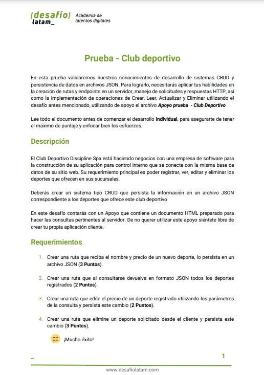

🚀[desafio_evaluado_26_prueba_modulo_6_club_deportivo2](https://desafio-evaluado-26-prueba-modulo-6-club.onrender.com)
.
👨🏽‍💻git commit -m ":sparkles: se integra todos los modulos o aplicaciones de node.js vistas en el modulo 6 del bootcamp, en el cual chalk, uuid, moment, lodash, axios y yargs se visualizan en el terminal por medio de comandos. Express, handlebars, jimp y nodemailer, se visualizan en la pagina web con su puerto asignado respectivamente, solo el index.js corresponde a la prueba"

<h1>Prueba - Club deportivo</h1>

www.desafiolatam.com
